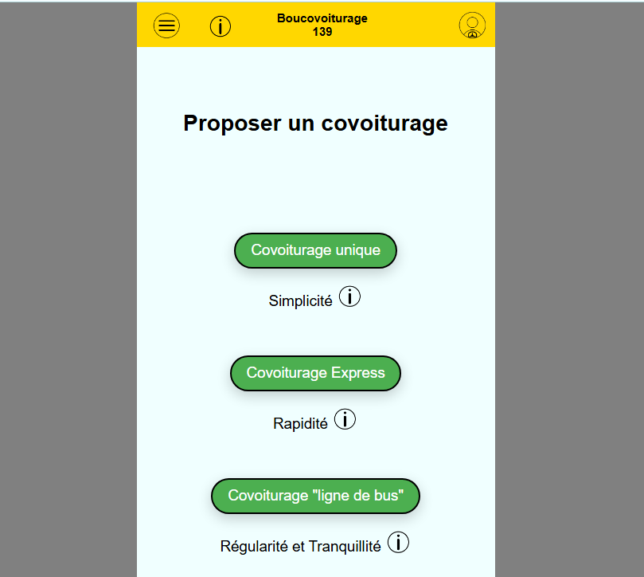

## 1. Introduction

Boucovoiturage.fr est une plateforme de covoiturage local 
 qui connecte les conducteurs ayant des places disponibles dans leur voiture avec des passagers cherchant à partager un trajet. L’objectif est de réduire les frais de transport tout en limitant l’impact environnemental lié à l’utilisation excessive des voitures individuelles.

A leur inscription les utilisateurs peuvent choisir si ils sont passagers ou conducteur (avec la possibilité de le changer par la suite)
Les conducteurs peuvent proposer ou réserver des trajets facilement via l'interface du site. Avec plusieurs possibilités de proposer des trajets.

---

## 2. Fonctionnalités principales

- **Recherche de trajets** : Les passagers peuvent rechercher des trajets selon des critères : la commune de départ et la commune d'arrivée. Avec le système de recherche une fois que le passagers selectionne les villes souhaitées , une liste de trajets répondant au critères s'affichent , avec la possibilité à l'utilisateur de voir l'heure de départ , la date et réserver directement par la suite.

- **Publication d'annonces** : Les conducteurs peuvent publier leurs trajets en renseignant les communes de départ et d'arrivée , la date l'heure de départ indiquer les places disponibles et si le passager doit participer ou non avec le cout associé.

- **Système de réservation** : Les passagers peuvent réserver directement un trajet avec le bouton "Poser une option" , par la suite le conducteur recevra une notification lui indiquant que quelqu'un désire voyager avec lui.

- **Messages privés** : Les utilisateurs peuvent communiquer entre eux via un système de messagerie intégré pour poser des questions ou organiser les détails du trajet. Chaque messages sont catégorisés en fonction du trajet correspondant. Et dans le cas ou il y aurait 2 ou 3 passagers la messagerie n'est pas partagée pour préserver l'intimité des utilisateurs.

- **Gestion du profil** : Chaque utilisateur possède un profil personnel avec des informations , qu'il peut choisir de divulger ou non. Comme une photo de profil , donner le nom de famille ou simplement l'initiale. Il peut également choisir de donner ou non son email ou son numéro de téléphone.

- **Planning de covoiturages** : Tout les utilisateurs ont un planning avec les informations du covoiturages et avoir accès aux informations des passagers ou conducteur en fonction du status (conducteur/passager) , ils peuvent parler entre eux via la messagerie , et voir les informations du trajet.

- 

---

## 3. Structure des pages

### Page d'accueil

La **page d'accueil** peut être personnalisée par l'utilisateur , qui peut directement choisir depuis un menu "Gérer mon écran d'accueil" ou il peut choisir de quel fonctionnalité va être affichée. 

### Page de recherche

La **page de recherche** permet à l'utilisateur de filtrer les trajets disponibles selon :
- Le lieu de départ.
- La destination.
- La date du trajet.
- Le nombre de places disponibles.
  
Si l'utilisateur est intéressé par le trajet , il clique sur le bouton "Voir" afin de pouvoir voir qui propose le trajet , avec le choix de réserver le trajet en "Posant une option".

### Page d'inscription et de connexion

Les utilisateurs doivent s’inscrire pour utiliser pleinement la plateforme. La **page d'inscription** demande les informations suivantes :
- Nom et prénom.
- Email et mot de passe.
- Numéro de téléphone.
- Ville de résidence 
- Passager ou conducteur
  
La **page de connexion** permet à un utilisateur inscrit de se connecter avec son email et mot de passe.

### Profil utilisateur

Le **compte utilisateur** contient :
- Les informations personnelles (modifiables).
- Possibilité de définir à l'avance le nombre de places dans le véhicule 
- Possibilité de définir à l'avance si le trajet est gratuit ou si une participation au frais est requise

### Page de réservation

Lorsqu’un passager choisit un trajet, il accède à la **page de réservation**, où il peut :
- Voir les détails du trajet et du conducteur.(si il le souhaite il peut voir le profil public du conducteur)
- Réserver une place.

### Page de planning 
Une fois qu'un passager a fais sa réservation , il peut accéder a une page "Planning de mes covoiturages" il peut voir les trajets qu'il a réservé ainsi que les trajets qui sont en attentes de validations par le conducteur. Il peut également annuler sa participation (en prenant en compte que toute sortie de ce covoiturage est définitif) il peut également parler avec la messagerie au conducteur.

### Liste des covoiturages proposé
Le conducteur a accès à la liste des covoiturages qu'il a proposé , avec la possibilité de voir si quelqu'un à demander a venir et l'option de pouvoir refuser ou accepter cette personne , si cette personne est acceptée alors elle s'affiche dans la liste des passagers. Et si le conducteur le souhaite il peut envoyer un message a cette personne.

---

## 4. Processus d'inscription

### Étapes d'inscription pour un passager/conducteur :
1. **Création de compte** : L'utilisateur entre ses informations personnelles comme son nom prénom , le choix d'être soit passager sois conducteur , la ville de résidence , le numéro de téléphone ainsi que l'email
2. **Validation de l'email** : Un lien de validation est envoyé par email pour confirmer l'adresse.
3. **Complétion du profil** : Une fois connecté l'utilisateur peut ajouter une photo de profil, et modifier les informations qu'il ne souhaite pas partager.

---

## 5. Fonctionnalitées 

### Étapes d'inscription pour un passager/conducteur :
1. **Création de compte** : L'utilisateur entre ses informations personnelles comme son nom prénom , le choix d'être soit passager sois conducteur , la ville de résidence , le numéro de téléphone ainsi que l'email
2. **Validation de l'email** : Un lien de validation est envoyé par email pour confirmer l'adresse.
3. **Complétion du profil** : Une fois connecté l'utilisateur peut ajouter une photo de profil, et modifier les informations qu'il ne souhaite pas partager.
   
### Etapes publication d'un covoiturage
1. **Choisir le type de covoiturage souhaité** : L'utilisateur a le choix de choisir entre trois types de covoiturages "simple" "express" et "ligne de bus"
2. **Création de publication pour covoiturage simple** : pour le covoiturage simple , vous rentrez les informations

---

